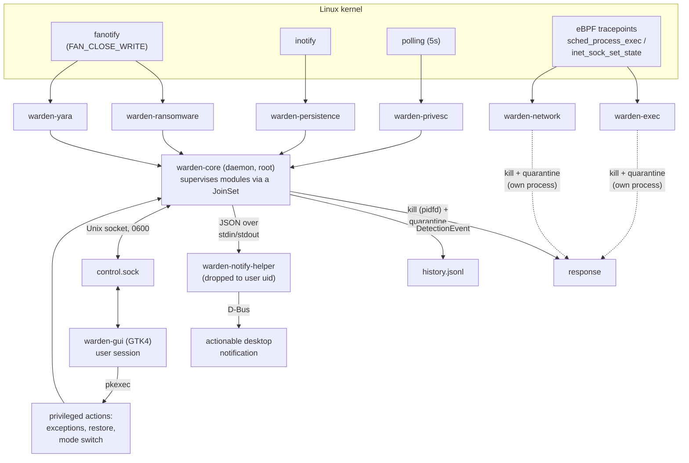

# Warden

Autonomous endpoint detection & response (EDR) for Linux workstations,
written in Rust. No server, no cloud dependency, no agent-to-collector
traffic — everything runs locally as a single hardened systemd service,
with an optional desktop GUI.

Warden watches for the handful of things that actually matter on a single
workstation — ransomware, persistence mechanisms, privilege escalation,
malicious file content, fileless execution and outbound network activity
from suspicious binaries — and either logs what it sees (`monitor` mode)
or kills/quarantines it immediately (`enforce` mode).

Every detection module has been pushed through real, adversarial
testing rather than just unit tests: two dedicated internal red-team
audits, an external community audit, and a full SAST pass each found and
fixed genuine bypasses — see [Hardened through real
testing](#hardened-through-real-testing-not-just-written) below, and
[PROGRESS.md](PROGRESS.md) for the full blow-by-blow history, every
design decision and the reasoning behind it.

## What it detects

- **Ransomware** (`warden-ransomware`): fanotify-based monitoring of the
  user's data directories. Flags a burst of high-entropy file rewrites
  (tracked per-process, per-directory, and globally, so fork-per-file and
  multi-directory spreading can't slip under any single counter),
  container-format signature forgery, and touches to seeded, per-machine
  randomized honeypot files (randomized folder name *and* filename,
  drawn from independent word pools) planted among real user
  directories. Entropy sampling reads three spread-out zones of each
  file (start, middle, end) and keeps the maximum, so prefixing a file
  with a plaintext header can't hide an encrypted payload.
- **Persistence** (`warden-persistence`): inotify-based monitoring of
  cron, sudoers.d, systemd units, XDG autostart entries, profile.d, and
  shell rc files for new or modified entries, with heuristics for
  obviously suspicious content (reverse-shell one-liners, curl-pipe-shell,
  etc.) and diffing against a baseline to catch subtle appended lines.
  Existing dotfiles are always report-only (never auto-reverted — a
  botched revert of `/etc/sudoers` could lock every admin out); a brand
  new file in a unit directory (cron.d, sudoers.d, autostart) is safe to
  quarantine outright.
- **Privilege escalation** (`warden-privesc`): polls for new setuid/setgid
  binaries and unexpected files dropped in system binary directories,
  distinguishing an existing system binary gaining the bit (GTFOBins-style
  — the bit is stripped, the binary kept) from a brand new setuid file
  (quarantined).
- **Malware signatures** (`warden-yara`): YARA-based scanning, both live
  (fanotify, on file close) and on-demand (`StartScan` over the control
  socket, restricted to the caller's own home directory and `/tmp`, with
  a symlink-root check and a 100 MB file-size cap against abuse).
- **Fileless exec & network** (`ebpf-probe/`, optional): eBPF tracepoints
  on `sched_process_exec` and `inet_sock_set_state` for exec/network
  visibility beyond what filesystem watching alone can see — a process
  launched from `/tmp` or `~/Downloads` gets killed and quarantined on
  execution; the same binary later opening an outbound connection is a
  second, independent line of defense if the first one was somehow
  missed. Needs a nightly Rust toolchain + `bpf-linker`; the rest of
  Warden works fully without it.

Every detection module runs its own independent watch loop inside the
same `warden` daemon process (except the two eBPF modules, which are
separate binaries/services). A single confirmed detection can kill the
offending process (`pidfd`-based, immune to PID-reuse races, with a
best-effort raw-`kill` fallback) and quarantine the affected files.

## Architecture at a glance



- **`warden`** (in `warden-core/`) — the main daemon. Runs as root
  (fanotify filesystem-wide marks, killing/quarantining arbitrary user
  processes, and stripping setuid bits all genuinely need it), but with a
  narrowed `CapabilityBoundingSet` and full systemd sandboxing
  (`ProtectSystem=strict`, `NoNewPrivileges`, `RestrictSUIDSGID`,
  `RestrictAddressFamilies=AF_UNIX`, `ProtectProc=invisible`,
  `WatchdogSec=30`, ...) — see [systemd/warden.service](systemd/warden.service)
  for the exact directives and the reasoning behind each one (including
  which hardening directive was tried and reverted because it broke the
  YARA module's JIT — see PROGRESS.md).
- **`warden-common`** — shared building blocks: quarantine (with
  cross-process `flock`-protected manifest, setuid-stripping on copy,
  path-length-safe naming), detection history, the SHA-256-anchored
  exceptions list, XDG directory resolution (hardened against a
  malicious `user-dirs.dirs` pointing at `/`), package-manager detection
  (UID-checked, directory-checked — to avoid flagging a legitimate
  `apt`/`dnf` upgrade without becoming a bypass itself), and
  `pidfd`-based process termination.
- **`warden-notify-helper`** — a tiny helper the daemon spawns with
  privileges dropped to the logged-in user, since a root process can't
  reach that user's D-Bus session bus (`dbus-daemon` refuses by design —
  see PROGRESS.md for the full investigation). Talks to the daemon over
  stdin/stdout as newline-delimited JSON, with `NOTIFY_SOCKET` stripped
  from its environment so it can never forge a systemd watchdog ping.
- **`warden-gui`** (GTK4 + libadwaita) — the desktop dashboard: live
  module status, detection history, quarantine management, on-demand
  scans, exception management, and mode switching — all consequential
  actions (`--add-exception`, `--quarantine-file`, `--set-mode`, ...) are
  gated behind real `pkexec` authentication, never reachable through the
  plain control socket. `QuarantineFile`/`RestoreQuarantine` were
  deliberately excluded from the socket protocol itself after a review
  found they'd let any process at the same uid disable protection
  without real authentication.
- **Control socket** (`/run/warden/control.sock`) — a Unix domain socket,
  owner-only (`0600`, `umask` set around `bind()` so it's never briefly
  wider), capped at 64 KiB per line (a client can't OOM the daemon by
  streaming without a newline), for read-only GUI queries (status,
  history, on-demand scan) that don't need a privileged prompt.

## Hardened through real testing, not just written

Warden's security model isn't a claim — it's the output of repeated,
adversarial testing against the actual running daemon, with every
finding reproduced, fixed, and re-validated live rather than just
patched and assumed fixed. The full history is in
[PROGRESS.md](PROGRESS.md); a few representative examples:

- **Package-manager spoofing**: `cp /bin/sleep /tmp/apt && /tmp/apt 300 &`
  used to be enough to make Warden think a real package manager was
  running and suspend auto-quarantine — found and fixed by checking that
  the binary's directory, not just its name, canonicalizes to a known
  system path.
- **Fork-per-file ransomware across multiple directories**: spreading 48
  encrypted files across 6 directories at 8 files each, each under its
  own short-lived PID, slipped under both the per-PID and per-directory
  thresholds — fixed with a third, global counter.
- **Unprivileged auto-quarantine bypass**: `is_active()` never checked
  the calling process's UID, so any local, non-root user could keep it
  permanently "true" and suspend Enforce-mode protection indefinitely —
  caught by an external community audit, fixed with a UID check.
- **A quarantine bypass via an overlong filename**: any detected file
  under a long enough path made both `rename` and its `copy` fallback
  fail with `ENAMETOOLONG`, *silently* — a 100%-reliable Enforce bypass
  for modules that only quarantine (no process to kill). Found in a
  dedicated SAST pass, fixed with safe truncation plus a collision-proof
  hash.
- **TOCTOU on the YARA and ransomware fanotify monitors**: both re-opened
  a file by path after the fact instead of using the original event's
  file descriptor, leaving a window to swap the content between the
  close event and the scan — fixed by reading through a `dup()`'d fd.

Every fix above shipped with a reproducing test and was re-validated
against the real daemon on real VMs (Debian, Ubuntu) and containerized
distros (Fedora, Arch, openSUSE) before being considered closed — not
just re-read.

## Building

Never built or run directly on a development host in this project's own
workflow — see [PROGRESS.md](PROGRESS.md)'s workflow rule. Build inside
the dedicated container:

```sh
docker build -t warden-build:rockylinux -f docker/Dockerfile.build .
docker run --rm -v "$PWD:/build" \
  -v warden-cargo-registry:/usr/local/cargo/registry \
  -w /build warden-build:rockylinux cargo build --release --workspace
```

The eBPF modules (`warden-exec`, `warden-network`) need a separate
nightly toolchain + `bpf-linker`, built via `docker/Dockerfile.build-ebpf`
against the `ebpf-probe/` sub-workspace.

Run the test suite and lints the same way:

```sh
docker run --rm -v "$PWD:/build" \
  -v warden-cargo-registry:/usr/local/cargo/registry \
  -w /build warden-build:rockylinux bash -c \
  "cargo test --workspace && cargo clippy --workspace --all-targets -- -D warnings"
```

[`.github/workflows/test.yml`](.github/workflows/test.yml) runs the same
build/test/clippy/`cargo-audit` checks automatically on every push and
pull request (not inside the Docker build container there, but on a
plain `ubuntu-latest` runner with the GTK4/libadwaita dev packages
installed directly).

## Installing (on a real machine)

```sh
sudo ./install.sh
```

Detects your distro's package manager (apt, dnf, pacman, or zypper),
installs build dependencies, builds Warden from source, installs the
systemd units (with a computed sandboxing drop-in for the target user's
actual home directory), and starts protection in either `enforce` mode
(kills/quarantines immediately) or `monitor` mode (logs only) — asked
interactively on a fresh install (defaults to `enforce` if not run
interactively; set `WARDEN_INSTALL_MODE=monitor` to skip the prompt).
Either way it's switchable anytime afterward from the GUI or
`warden --set-mode`. Safe to re-run to upgrade an existing install in
place — it never overwrites an existing `config.toml`, so re-running
never resets a mode you already chose, and it always prefers your own
rustup toolchain over an outdated distro-packaged `cargo` if one happens
to be on the `PATH`.

To remove it:

```sh
sudo ./uninstall.sh            # stops services, removes binaries/units/GUI assets
                                # — config and quarantine are left in place
sudo ./uninstall.sh --purge    # also removes config and quarantine, after confirmation
```

Both scripts have been validated end-to-end (real install → real
detection → real uninstall) across every supported package-manager
family: apt on two real VMs (Debian 13, Ubuntu 25.10), and dnf/pacman/
zypper each in a dedicated systemd-as-PID1 Docker test image (see
`docker/Dockerfile.test.*`).

## Status

Under active development, hardened through multiple rounds of real
adversarial testing against the running detection modules — two internal
red-team audits, one external community audit, and a dedicated SAST pass
(fanotify TOCTOU windows, package-manager spoofing, honeypot naming,
burst-detector bypasses, control-socket oracles, an overlong-filename
quarantine bypass, and more — every one confirmed live and fixed; see
[PROGRESS.md](PROGRESS.md) for the full list). All four core detection
modules, the GUI, desktop notifications, the control socket, quarantine
with cross-process locking, and the installer/uninstaller are implemented
and tested. Not yet done: a simplified Sigma-rule detection layer,
`setcap`-based capability tracking for privesc (SUID/SGID only today),
and `cargo-deny` alongside the `cargo-audit` check already in place.

## License

MIT.
